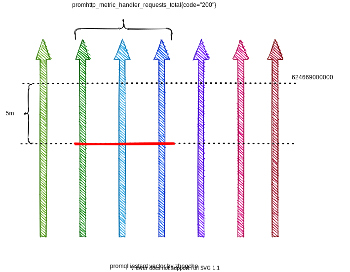
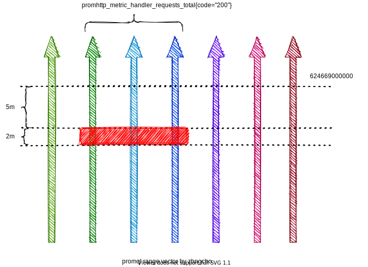

### 寒潮来袭，发布大风红色预警

[toc]


#### 来呀，一起看图说话！


在一片田野中有一个气象站，一名气象员正在把气象数据记录到记录表上

##### 分析下包含的元素

- 一片田野
- 一个气象站
- 一名气象员
- 气象数据
- 记录表

##### 说明以下元素之间的关系




##### Hi,我带着气象数据回来啦～




##### 您好，请问气象站怎么走啊？



##### 好啦，来看个非重点的图  ：）


##### 再来个非重点总结  ：）

1. pull 模型，prometheus 主动通过 http 请求收集指标 (prometheus 就是个四处奔波的气象记录员)
2. prometheus 通过一个自己的 http 服务接收 promQL 对外提供数据查询服务（根据自己记录的气象指标，如温度、湿度、风力等为别人提供查询服务）
3. prometheus 通过配置的报警规则推送报警信息给 alertmanager （如果温度大于40度就马上联系政府）


#### 看看气象站是个啥构造啊？

**[气象站](https://zh.wikipedia.org/wiki/%E6%B0%94%E8%B1%A1%E7%AB%99)**（英语：weather station）指为了取得气象资料而建成的观测站，不少气象站内设有[气压计](https://zh.wikipedia.org/wiki/氣壓計)、[温度计](https://zh.wikipedia.org/wiki/溫度計)及[雨量计](https://zh.wikipedia.org/wiki/雨量計)等被动式感应器来量度各种气象要素，部分气象站还设有地表及不同深度之[土壤](https://zh.wikipedia.org/wiki/土壤)或地表温度观测、海水温度观测等仪器。[[1\]](https://zh.wikipedia.org/wiki/气象站#cite_note-中央氣象局全球資訊網-1)风向和风速计一般要求周边没有或只有很少阻挡，而温度和湿度计则要求远离阳光和辐射源的照射。海上的气象浮标和气象观测船可提供更多数据，如[海水温度](https://zh.wikipedia.org/w/index.php?title=海水溫度&action=edit&redlink=1)、[浪](https://zh.wikipedia.org/wiki/波濤)高和[潮汐](https://zh.wikipedia.org/wiki/潮汐)周期等。

##### 非重点举例之 node_exporter


- ` curl http://127.0.0.1:9100/metrics > node_exporter.metrics `
- 工作是导出机器相关的指标，以备 prometheus 采集


#### 好想看看记录表上的记录啊。。。




1. 如果看起来这个记录很别扭的话，可能是你的姿势不太对（因为你没有倒立起来看）
2. 这就是所谓的时序数据（TS）
3. 看图回答以下几个问题
   - 1989-10-17 中国的平均温度是多少摄氏度？
   - 1989-10-18 岛国的平均温度是多少摄氏度？
   - 1989-10-15～1989-10-18 北美洲的平均温度是多少摄氏度？
4. 请用华氏度来重新回答以上问题
5. 不相关总结：
   - prometheus 把定期收集到的指标存成时间序列（温度{洲际:"亚洲", 海陆: "沿海", 国家:"中国" } (1989-10-14, 24), (1989-10-15, 25), (1989-10-16, 21) ... ）
   - prometheus 通过配置的预聚合规则，通过已有时间序列生成新的时间序列（总有人问华氏度，那不妨用摄氏度的记录誊写一份华氏度的记录，免得每次都要百度查换算方式浪费时间和精力）

##### 不相关图示

- prometheus 时间序列示意图

​	

##### 不相关说明之promeQL (找谁干啥)

1. 瞬时查询

   - 示意图

     

   - 语法 `promhttp_metric_handler_requests_total{code="200"} @ 624669000000 offset 5m`

   - 结果为一个向量

     ```
     promhttp_metric_handler_requests_total{code="200", instance="localhost:9090", job="prometheus"}
     77552
     promhttp_metric_handler_requests_total{code="200", instance="localhost:9100", job="node"}
     ```

2. 区间查询

   - 示意图

     

   - 语法 `promhttp_metric_handler_requests_total{code="200"} [2m] @ 624669000000 offset 5m`

   - 结果为区间向量

     ```
     promhttp_metric_handler_requests_total{code="200", instance="localhost:9090", job="prometheus"}
     77639 @1634823906.889
     77640 @1634823921.889
     77641 @1634823936.889
     77642 @1634823951.889
     77643 @1634823966.889
     77644 @1634823981.889
     77645 @1634823996.889
     77646 @1634824011.889
     promhttp_metric_handler_requests_total{code="200", instance="localhost:9100", job="node"}
     77647 @1634823909.821
     77648 @1634823924.821
     77649 @1634823939.821
     77650 @1634823954.821
     77651 @1634823969.821
     77652 @1634823984.821
     77653 @1634823999.821
     77654 @1634824014.821
     ```

3. 其他说明， 以下均为合法表达式

   - 无offset, `promhttp_metric_handler_requests_total{code="200"}`
   - 无 metrics name, `{__name__ = "promhttp_metric_handler_requests_total", code="200"}`
   - 无 labels, `promhttp_metric_handler_requests_total`
   - label = value, label != value, label =~ reg, label !~ reg 都支持（reg 不能匹配空字符串）

#### 什么，想知道记录有啥类型？

1. 记录只有一种类型，时间序列（这太正确了，正确到不需要额外说明！！！）

2. 记录有四种类型， counter, gauge, histogram, summary (至少听大多数人都这么说，并有例子佐证 )

   - 获取指标： ` curl http://127.0.0.1:9090/metrics > prometheus.metrics `

   - counter: 递增计数器

     ```
     # HELP promhttp_metric_handler_requests_total Total number of scrapes by HTTP status code.
     # TYPE promhttp_metric_handler_requests_total counter
     promhttp_metric_handler_requests_total{code="200"} 71842
     promhttp_metric_handler_requests_total{code="500"} 0
     promhttp_metric_handler_requests_total{code="503"} 0
     ```

   - gauge: 可增可减的值

     ```
     # HELP go_goroutines Number of goroutines that currently exist.
     # TYPE go_goroutines gauge
     go_goroutines 10
     ```

   - histogram: 直方图

     ```
     # HELP prometheus_http_request_duration_seconds Histogram of latencies for HTTP requests.
     # TYPE prometheus_http_request_duration_seconds histogram
     prometheus_http_request_duration_seconds_bucket{handler="/",le="0.1"} 1
     prometheus_http_request_duration_seconds_bucket{handler="/",le="0.2"} 1
     prometheus_http_request_duration_seconds_bucket{handler="/",le="0.4"} 1
     prometheus_http_request_duration_seconds_bucket{handler="/",le="1"} 1
     prometheus_http_request_duration_seconds_bucket{handler="/",le="3"} 1
     prometheus_http_request_duration_seconds_bucket{handler="/",le="8"} 1
     prometheus_http_request_duration_seconds_bucket{handler="/",le="20"} 1
     prometheus_http_request_duration_seconds_bucket{handler="/",le="60"} 1
     prometheus_http_request_duration_seconds_bucket{handler="/",le="120"} 1
     prometheus_http_request_duration_seconds_bucket{handler="/",le="+Inf"} 1
     prometheus_http_request_duration_seconds_sum{handler="/"} 4.0507e-05
     prometheus_http_request_duration_seconds_count{handler="/"} 1
     ```

   - summary: 分位数

     ```
     # HELP go_gc_duration_seconds A summary of the pause duration of garbage collection cycles.
     # TYPE go_gc_duration_seconds summary
     go_gc_duration_seconds{quantile="0"} 2.71e-05
     go_gc_duration_seconds{quantile="0.25"} 5.4368e-05
     go_gc_duration_seconds{quantile="0.5"} 0.000151666
     go_gc_duration_seconds{quantile="0.75"} 0.000257266
     go_gc_duration_seconds{quantile="1"} 0.002850318
     go_gc_duration_seconds_sum 42.687752096
     go_gc_duration_seconds_count 159934
     ```

3. 等等，好像还是只有一种类型

​			

#### 加工一下记录吧 ：）

- 啥叫向量？
- 啥叫标量？
- 啥叫瞬时向量？
- 啥叫区间向量？

##### 简单加工

- 算术运算符: `+ - * / % ^`
  - 操作数: 
    - 标量&标量`1+2`
    - 标量&向量 `promhttp_metric_handler_requests_total{code="200"} + 1`
    - 向量&标量 `1+promhttp_metric_handler_requests_total{code="200"}`
    - 向量&向量 `promhttp_metric_handler_requests_total{code="200"} - promhttp_metric_handler_requests_total{code="200"} offset 5m`
- 比较运算符 `== != > < >= <=`
  - 操作数
    - 标量&标量`1 > bool 2`
    - 向量&标量 `promhttp_metric_handler_requests_total{code="200"} > 1`
    - 向量&标量 `promhttp_metric_handler_requests_total{code="200"} > bool 1`
    - 标量&向量 `1 > promhttp_metric_handler_requests_total{code="200"}`
    - 标量&向量 `1 > bool promhttp_metric_handler_requests_total{code="200"}`
    - 向量&向量 `promhttp_metric_handler_requests_total{code="200"} > promhttp_metric_handler_requests_total{code="200"} offset 5m`
    - 向量&向量 `promhttp_metric_handler_requests_total{code="200"} > bool promhttp_metric_handler_requests_total{code="200"} offset 5m`
  - 以上 bool 为修饰符，无 bool 则表示过滤时间序列，有 bool 则表示时间序列的计算（参考瞬时查询示意图）
- 集合运算符 `and or unless`
  - 操作数
    - 向量&向量 `promhttp_metric_handler_requests_total{code="200"} and {instance =~ ".*9100"}`
  - 整体运算方式为以左操作数为主，根据不同的运算，在左操作数中进行添加和删除元素
- 向量匹配规则
  - 一对一
    - `prometheus_http_requests_total{code="200", handler="/api/v1/query", instance="localhost:9090", job="prometheus"} / ignoring(handler) promhttp_metric_handler_requests_total{code="200", instance="localhost:9090", job="prometheus"}`
  - 一对多
    - `promhttp_metric_handler_requests_total{instance="localhost:9090", job="prometheus"}/ignoring(handler) group_right  prometheus_http_requests_total{code="200",  instance="localhost:9090", job="prometheus"} `
  - 多对一
    - `prometheus_http_requests_total{code="200",  instance="localhost:9090", job="prometheus"} / ignoring(handler) group_left promhttp_metric_handler_requests_total{instance="localhost:9090", job="prometheus"}`
  - 注意： *Many-to-one and one-to-many matching are advanced use cases that should be carefully considered. Often a proper use of `ignoring(<labels>)` provides the desired outcome.*

##### 深入加工

###### 瞬时向量的聚合

- `sum count min max avg quantile stddev stdvar topk bottomk ... `

- `sum (prometheus_http_requests_total{ instance="localhost:9090", job="prometheus"}) without (code)`
- `sum (prometheus_http_requests_total{ instance="localhost:9090", job="prometheus"}) by (code)`

###### 区间向量的聚合（\<aggregation\>_over_time())

- `avg_over_time(prometheus_http_requests_total [5m])`

##### 其他函数

`ceil(v instant-vector) irate(v range-vector) ...`

#### 一些有意思的问题

- 如果每隔一个固定时间间隔就运行一次瞬时向量查询，综合所的结果是个什么样子？（这是一个子查询rate(prometheus_http_requests_total[5m]) [30m:1m]）

- 时间序列 foo [(0, 23), (15, 50), (30, 45), (45, 8), (60, 10), ...]，foo @ 17 的结果是什么？

  ```shell
  echo 'rule_files:' > test.yml
  echo 'evaluation_interval: 1s'>> test.yml
  echo 'tests:' >> test.yml
  echo '- interval: 15s' >> test.yml
  echo '  input_series:'>> test.yml
  echo '  - series: foo'>> test.yml
  echo '    values: 23 50 45 8 10'>> test.yml
  echo '  promql_expr_test:'>> test.yml
  echo '  - expr: foo'>> test.yml
  echo '    eval_time: 17s'>> test.yml
  echo '    exp_samples:'>> test.yml
  echo '    - labels: "foo{}"' >> test.yml
  echo '      value: 50' >> test.yml
  promtool test rules test.yml
  ```

- 再来一次，时间序列 foo [(0, 23), (15, 50), (30, 45), (45, 8), (60, 10), ...]，foo @ 17 的结果是什么？

  ```shell
  echo 'rule_files:' > test.yml
  echo 'evaluation_interval: 10s'>> test.yml
  echo 'tests:' >> test.yml
  echo '- interval: 15s' >> test.yml
  echo '  input_series:'>> test.yml
  echo '  - series: foo'>> test.yml
  echo '    values: 23 50 45 8 10'>> test.yml
  echo '  promql_expr_test:'>> test.yml
  echo '  - expr: foo'>> test.yml
  echo '    eval_time: 17s'>> test.yml
  echo '    exp_samples:'>> test.yml
  echo '    - labels: "foo{}"' >> test.yml
  echo '      value: 50' >> test.yml
  promtool test rules test.yml
  ```

  
